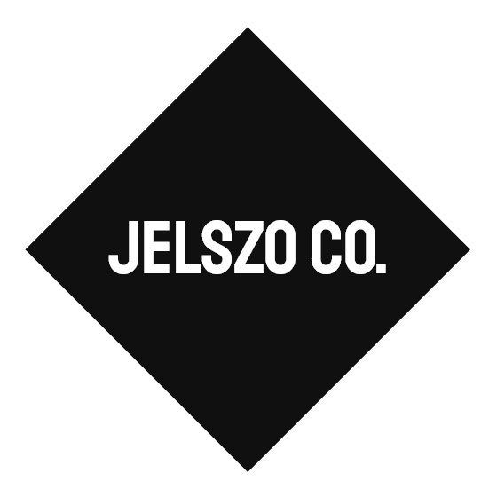

  
  <h3 align="center">Bakonyi Bitfaragó Bajnokság - 2019</h3>
  <h4 align="center">Jelszo csapat </h4>
  

    Iskola: Nyíregyházi Kölcsey Ferenc Gimnázium - Felkészítő tanár: Mikó Csaba
     
    <a href="https://github.com/jelszo-co/b3-2019/issues">Hiba jelentése</a>
  

### KÉSZÍTŐK

- **Kiss Benedek Máté** - <i> JavaScript / React </i>

- **Jóvári Norbert** - <i> HTML5, CSS3 </i>

- **Tóth Bence** - <i> Feladatok elméleti megoldása </i>

### FELHASZNÁLT NYELVEK / ESZKÖZÖK
Minden esetben a lehető legtisztább, legátláthatóbb, legegyszerűbb kód megírására törkedtünk. Az alap <b> HTML5 </b> és <b> CSS3 </b> nyelvek mellett használtunk még <b> JavaScript / React</b>-et is.

### RÓLUNK

A Jelszo Co. egy nyíregyházi fejlesztőcsapat akik szívesen mérik össze tudásukat másokkal, és nyitottak mindenfajta új ötlet felé.
 

<a href="https://m.me/jelszoco">Messenger</a>
·
<a href="https://discord.gg/akeTTJy">Discord</a>
·
<a href="mailto:support@jelszo.co">E-mail</a>

